<div align="center">

# SegWise — Customer Intelligence Platform

### Unsupervised ML-powered E-commerce Customer Segmentation

[](https://python.org)
[](https://streamlit.io)
[](https://scikit-learn.org)
[](https://plotly.com)
[](https://jupyter.org)
[](LICENSE)

> **Discover who your customers really are.**
> SegWise applies PCA + K-Means / Agglomerative Clustering to transform 2,240 raw SmartCart customer records into four actionable business personas — then surfaces them in an interactive Streamlit dashboard with live segment prediction for new customers.

</div>

---

## Table of Contents

- [Problem Statement](#-problem-statement)
- [Solution Overview](#-solution-overview)
- [Key Features](#-key-features)
- [Overall Architecture](#-overall-architecture)
- [System Architecture](#-system-architecture)
- [Technology Stack](#-technology-stack--complete-breakdown)
- [ML Pipeline](#-ml-pipeline)
- [Request Lifecycle](#-request-lifecycle)
- [Data Flow](#-data-flow)
- [UML Diagrams](#-uml-diagrams)
- [DFD Diagrams](#-data-flow-diagrams)
- [Folder Structure](#-folder-structure)
- [Dataset](#-dataset)
- [Prerequisites](#-prerequisites)
- [Installation](#-installation)
- [Running the App](#-running-the-app)
- [Page Reference](#-page-reference)
- [Data Schema](#-data-schema)
- [Engineering Decisions](#-engineering-decisions--tradeoffs)
- [Security Considerations](#-security-considerations)
- [Performance Optimizations](#-performance-optimizations)
- [Troubleshooting](#-troubleshooting)
- [Contributing](#-contributing)
- [Author](#-author)

---

## 🎯 Problem Statement

E-commerce businesses like SmartCart accumulate vast customer behavioural data — purchases, income, spend categories, visit frequency — but struggle to move beyond one-size-fits-all marketing. Sending the same promotional email to a high-income power buyer and a dormant budget shopper wastes spend and damages retention.

**The gap:** No structure exists in the raw customer database to distinguish high-value segments from disengaged ones. Business teams cannot personalise at scale without a data-driven segmentation layer.

---

## 💡 Solution Overview

SegWise is a two-phase system:

1. **Offline Training Pipeline** (`notebooks/seg-wise.ipynb`): A deterministic, reproducible Jupyter notebook that ingests the SmartCart CSV, engineers features, reduces dimensionality with PCA, evaluates K-Means vs Agglomerative Clustering using elbow + silhouette scoring, and serialises the winning model bundle to `models/segwise_model.pkl`.

2. **Interactive Dashboard** (`app.py`): A Streamlit web app that loads the saved bundle, visualises all four customer segments in 3D, lets analysts drill into any persona, and predicts which segment a brand-new customer belongs to — in real time.

**Output personas discovered:**

| Cluster | Persona | Key Trait |
|---------|---------|-----------|
| 0 | Casual Buyers | Low income · Low spend · Web browsers |
| 1 | VIP Shoppers | High income · High spend · Catalog buyers |
| 2 | Deal Hunters | Mid income · High spend · Discount-driven |
| 3 | Dormant Users | Low income · Very low spend · Infrequent |

---

## ✨ Key Features

| Feature | Description |
|---------|-------------|
| **3D Scatter Visualisation** | Rotate and explore all customers in Income × Spending × Age space with Plotly |
| **Elbow + Silhouette Validation** | Optimal K discovered automatically using KneeLocator — no manual guessing |
| **Dual Algorithm Comparison** | Both K-Means and Agglomerative Clustering trained; best by silhouette score wins |
| **PCA Dimensionality Reduction** | 17-feature space compressed to 3 principal components while retaining variance |
| **Real-time Customer Prediction** | Enter any customer's attributes and instantly get their predicted persona |
| **Segment Deep-Dive** | Filter by persona, view distribution histograms, download filtered CSV |
| **Correlation Heatmap** | Full feature correlation matrix on raw dataset — spots multicollinearity |
| **Streamlit Caching** | `@st.cache_resource` for model, `@st.cache_data` for DataFrames — zero reload lag |
| **Model Bundle Serialisation** | One pickle file bundles scaler + OHE + PCA + model + persona_map |
| **Reproducibility by Design** | `random_state=42` throughout; CONFIG dict for single-source-of-truth constants |

---

## 🏗️ Overall Architecture

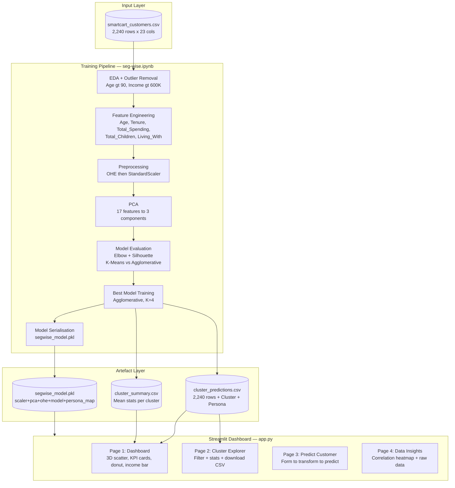

---

## ⚙️ System Architecture

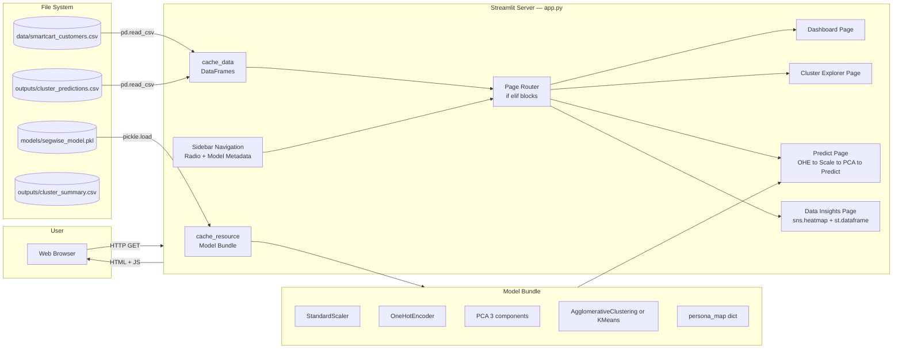

---

## 🧰 Technology Stack — Complete Breakdown

### Core ML / Data Science Layer

| Technology | Version | Category | Purpose in Project | Why Chosen | Key Features Used |
|---|---|---|---|---|---|
| scikit-learn | ≥1.4.2 | ML Framework | KMeans, AgglomerativeClustering, StandardScaler, PCA, OneHotEncoder | Industry standard; consistent API | `fit_transform`, `transform`, `predict`, `silhouette_score` |
| pandas | ≥2.1.4 | Data Processing | CSV loading, feature engineering, groupby, describe | Tabular de facto standard | `read_csv`, `groupby`, `describe`, `isnull`, `concat` |
| numpy | ≥1.26.4 | Numerical Computing | Array ops, triu mask, vstack for Agglomerative workaround | Low-level array control | `triu`, `ones_like`, `vstack`, `number` dtype |
| kneed | ≥0.8.5 | ML Utility | Auto-detect elbow in WCSS vs K curve | Removes subjective visual picking | `KneeLocator` with concave + decreasing |

### Visualisation Layer

| Technology | Version | Category | Purpose in Project | Why Chosen | Key Features Used |
|---|---|---|---|---|---|
| plotly | ≥5.18.0 | Interactive Charts | 3D scatter, donut pie, horizontal bar, histogram | Interactive hover/zoom/rotate in browser | `px.scatter_3d`, `px.pie`, `px.bar`, `px.histogram` |
| matplotlib | ≥3.8.2 | Static Charts | Correlation heatmap base figure | seaborn builds on it; `st.pyplot` renders inline | `subplots`, `tight_layout`, `close` |
| seaborn | ≥0.13.2 | Statistical Charts | Heatmap on dashboard Page 4 | One-line heatmaps with aesthetic defaults | `heatmap` with `annot`, `cmap`, `mask`, `fmt` |

### Application Layer

| Technology | Version | Category | Purpose in Project | Why Chosen | Key Features Used |
|---|---|---|---|---|---|
| streamlit | ≥1.31.0 | Web Framework | Entire dashboard UI | Zero-HTML, Python-only, reactive execution | `@cache_resource`, `@cache_data`, `columns`, `form`, `metric`, `plotly_chart`, `download_button` |

### Persistence Layer

| Technology | Version | Category | Purpose in Project | Why Chosen | Key Features Used |
|---|---|---|---|---|---|
| pickle | stdlib | Serialisation | Serialise full model bundle to one `.pkl` | Zero-dependency; preserves fitted sklearn state | `pickle.dump`, `pickle.load`, binary mode |

### Dev Tooling

| Technology | Version | Category | Purpose in Project | Why Chosen | Key Features Used |
|---|---|---|---|---|---|
| jupyter | ≥1.0.0 | Notebook Runtime | Training pipeline; cell-by-cell EDA | Interactive experimentation, inline charts | Kernel, cell execution, markdown cells |
| uv venv | — | Virtual Env | Isolated Python environment at `.venv/` | Fast dependency resolution | `uv pip install` |

---

## 🔬 ML Pipeline

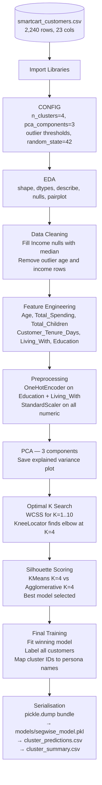

**Persona mapping by cluster statistics:**

| Cluster | Persona | Avg Income | Avg Spend | Defining Traits |
|---|---|---|---|---|
| 0 | Casual Buyers | ~$37K | $166 | High children, frequent web visits, low purchase rate |
| 1 | VIP Shoppers | ~$71K | $1,167 | Low children, catalog buyers, high engagement |
| 2 | Deal Hunters | ~$70K | $1,193 | Low children, deal purchasers, moderate web visits |
| 3 | Dormant Users | ~$37K | $169 | High children, low engagement, low spend |

---

## 🔄 Request Lifecycle

### Lifecycle 1: Dashboard Page Load

```
1. BROWSER REQUEST
   └── User navigates to localhost:8501
       → Streamlit serves app.py from top

2. CACHE CHECK — Model Bundle
   └── @st.cache_resource → load_model()
       → First run: open("models/segwise_model.pkl", "rb")
       → pickle.load() → reconstructs scaler, pca, ohe, model, persona_map
       → Subsequent runs: returns cached object (zero disk I/O)

3. CACHE CHECK — DataFrames
   └── @st.cache_data → load_data() → pd.read_csv("data/smartcart_customers.csv")
   └── @st.cache_data → load_predictions() → pd.read_csv("outputs/cluster_predictions.csv")

4. SIDEBAR → page = "Dashboard"

5. DASHBOARD PAGE
   └── 4 KPI metrics from df_pred
   └── px.scatter_3d(df_pred, x=Income, y=Total_Spending, z=Age, color=Persona)
   └── seg_counts = df_pred.Persona.value_counts() → px.pie (donut)
   └── income_by_seg = df_pred.groupby(Persona)[Income].mean() → px.bar

6. RESPONSE → Streamlit serialises to WebSocket → Browser renders HTML + Plotly JS
```

### Lifecycle 2: Predict New Customer (Form Submit)

```
1. USER FILLS FORM → 13 input widgets inside st.form (batched — no re-run until submit)

2. SUBMIT CLICKED → submitted = True → script re-runs
   └── Build new_customer_dict → pd.DataFrame([dict]) → df_new [1 row]
   └── ohe.transform(cat_input)     ← uses EXISTING vocabulary from training
   └── pd.concat([df_new, cat_df])  ← combine numeric + OHE columns
   └── df_final = df_final[bundle["features"]]  ← align to training column order
   └── scaler.transform(df_final)   ← z-score with TRAINING mean/std (not this row)
   └── pca.transform(X_scaled)      ← project onto EXISTING eigenvectors
   └── model.predict(X_pca)         ← distance to centroid (KMeans)
                                    OR refit workaround (Agglomerative)
   └── persona = persona_map[cluster_id]

3. DISPLAY → st.success(persona) + st.info(marketing tip)

ERROR PATH: pkl not found → st.error() → st.stop() (clean halt, no broken UI)
```

---

## 📊 Data Flow

```
RAW CSV [2240 × 23]
  → pd.read_csv()
  → Cleaning: drop outliers, fill Income nulls
  → Feature Engineering: +Age, +Total_Spending, +Total_Children, +Tenure, +Living_With
  → OneHotEncoder (Education 3-cat, Living_With 2-cat) → 5 OHE columns
  → StandardScaler (z-score, all numeric) → 12 scaled columns
  → PCA(n=3) → X_pca [2216 × 3]
  ┌──────────────────────────────────────┐
  │  K-Means(K=4)  vs  Agglomerative(K=4) │
  │  Silhouette scored → best wins        │
  └──────────────────────────────────────┘
  → cluster_labels [0,1,2,3] → persona_map → Persona strings
  → cluster_predictions.csv + cluster_summary.csv
  → segwise_model.pkl (scaler+ohe+pca+model+map bundled)
       ↓
  Streamlit @cache_resource loads pkl once
  Streamlit @cache_data loads CSVs once
       ↓
  Page 1: df_pred → Plotly 3D scatter + donut + bar
  Page 2: df_pred.filter(Persona) → histograms + CSV download
  Page 3: form → ohe.transform → scaler.transform → pca.transform → model.predict
  Page 4: df_raw → sns.heatmap + st.dataframe
```

---

<details>
<summary>📐 UML Diagrams Suite (click to expand)</summary>

### 1. Use Case Diagram

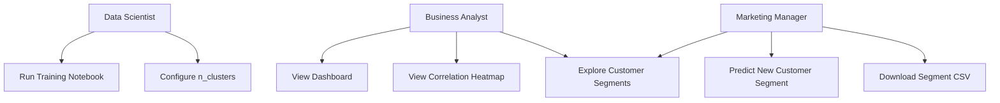

### 2. Class Diagram

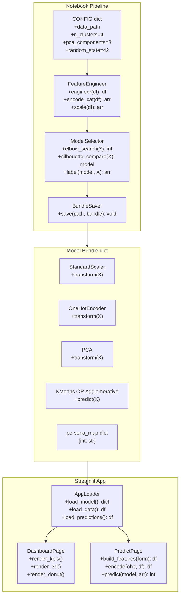

### 3. Sequence Diagram — Prediction Flow

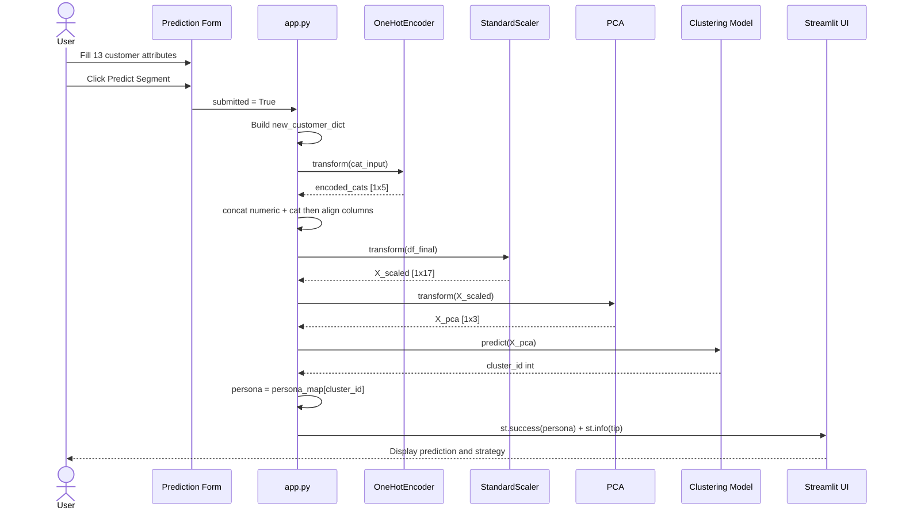

### 4. Activity Diagram — Training Pipeline

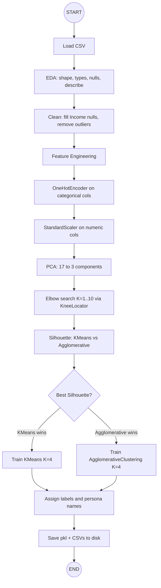

### 5. State Diagram — App States

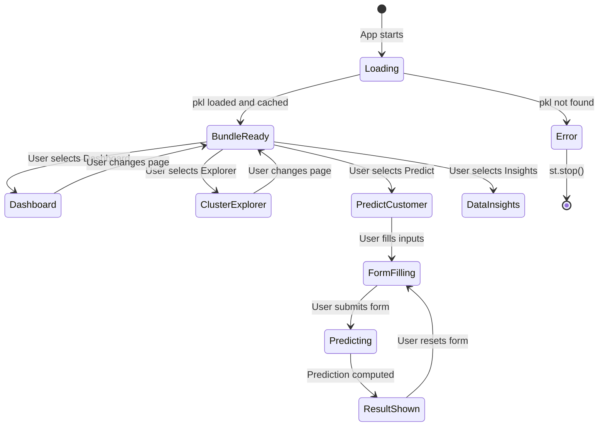

### 6. Component Diagram

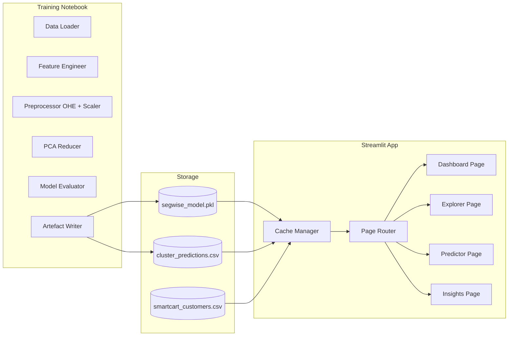

### 7. Deployment Diagram

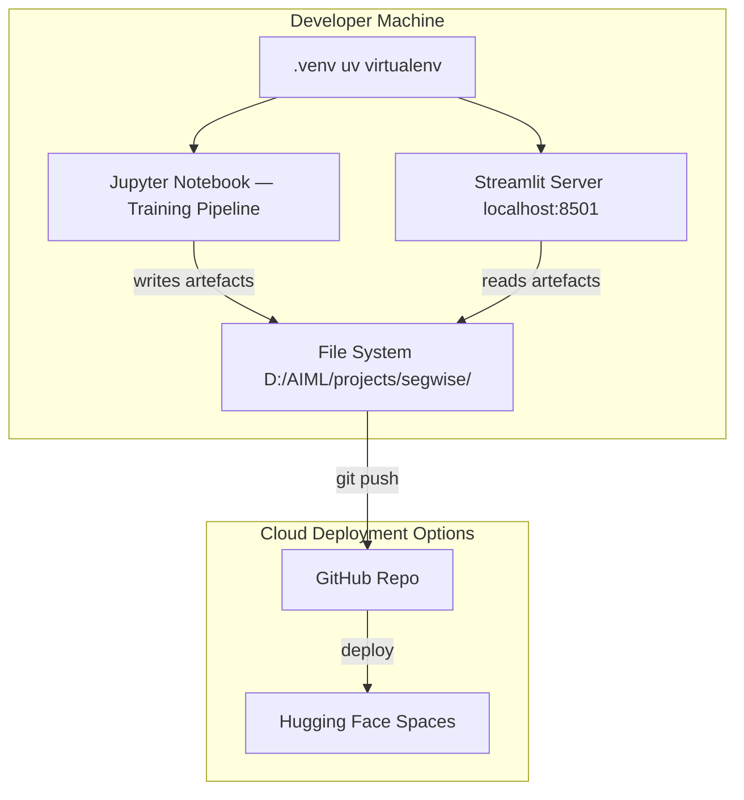

### 8. Object Diagram — Model Bundle

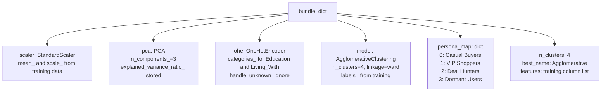

### 9. Package Diagram

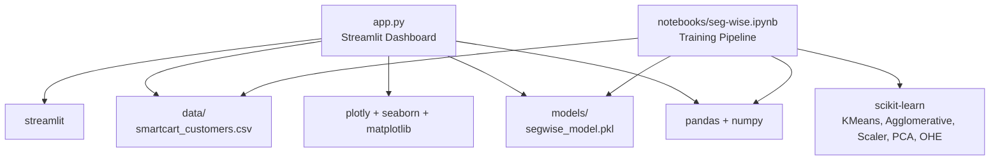

### Swimlane

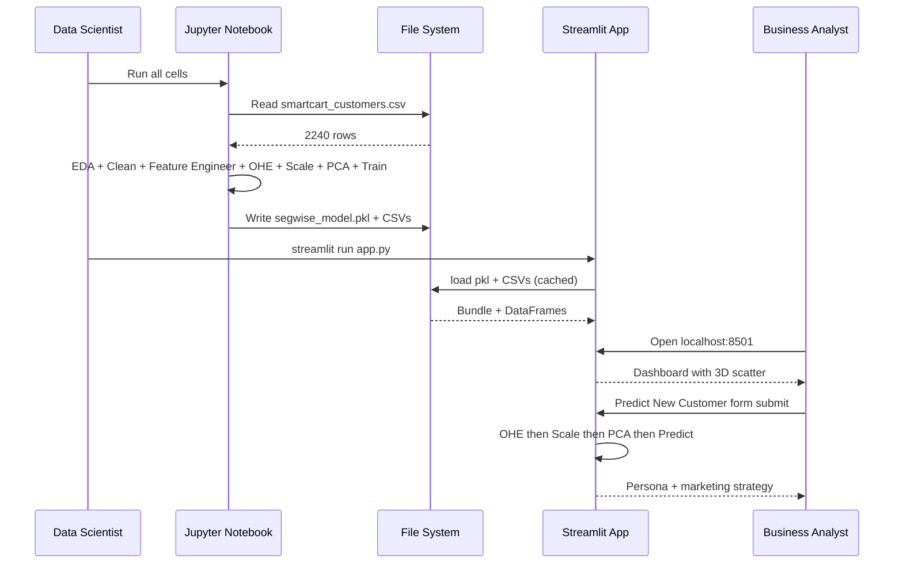

</details>

---

<details>
<summary>📊 Data Flow Diagrams (click to expand)</summary>

### DFD Level 0 — Context Diagram

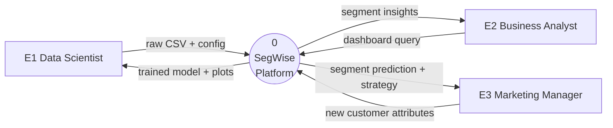

### DFD Level 1 — System Decomposition

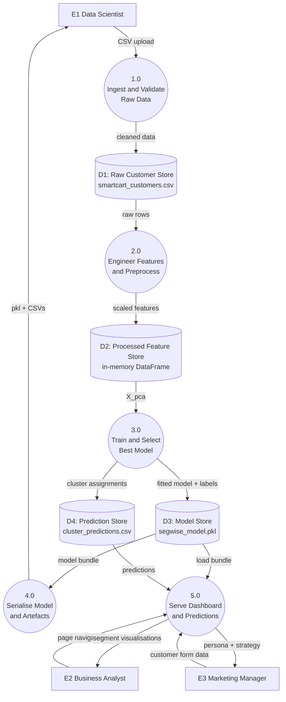

</details>

---

## 📁 Folder Structure

```
segwise/
├── app.py                          ← Streamlit dashboard (1073 lines, fully annotated)
├── requirements.txt                ← Python dependencies
├── notebooks/
│   └── seg-wise.ipynb              ← Main training pipeline (27 cells)
├── segwise_eda.ipynb               ← Standalone EDA exploration notebook
├── data/
│   └── smartcart_customers.csv     ← Raw dataset (2,240 rows × 23 columns)
├── models/
│   └── segwise_model.pkl           ← Serialised model bundle [run notebook first]
├── outputs/
│   ├── 00_pairplot_raw.png
│   ├── 00b_correlation_heatmap.png
│   ├── 01_pca_raw.png
│   ├── 02_optimal_k.png
│   ├── 03_pca_3d_clusters.png
│   ├── 04_income_vs_spending.png
│   ├── 05_cluster_sizes.png
│   ├── 06_cluster_heatmap.png
│   ├── cluster_predictions.csv     ← All customers + Cluster + Persona
│   └── cluster_summary.csv         ← Mean stats per cluster
├── .venv/                          ← uv virtual environment (not committed)
├── .vscode/settings.json           ← Python interpreter → .venv
└── .gitignore
```

---

## 📦 Dataset

**SmartCart Customer Dataset** — `data/smartcart_customers.csv` — 2,240 rows × 23 columns

| Column | Type | Description |
|--------|------|-------------|
| `ID` | int | Customer ID (dropped after load) |
| `Year_Birth` | int | → engineered to `Age` |
| `Education` | str | Graduation/Master/PhD → simplified to 3 levels |
| `Marital_Status` | str | → `Living_With` (Partner / Alone) |
| `Income` | float | Annual household income (24 nulls → filled with median) |
| `Kidhome` | int | Kids in household |
| `Teenhome` | int | Teens in household |
| `Dt_Customer` | str | Enrolment date → `Customer_Tenure_Days` |
| `Recency` | int | Days since last purchase |
| `MntWines` .. `MntGoldProds` | int | Spend per category → summed to `Total_Spending` |
| `NumDealsPurchases` | int | Discount purchases |
| `NumWebPurchases` | int | Web-channel purchases |
| `NumCatalogPurchases` | int | Catalog purchases |
| `NumStorePurchases` | int | In-store purchases |
| `NumWebVisitsMonth` | int | Non-purchase website visits |
| `Complain` | int | Complained in last 2 years (0/1) |
| `Response` | int | Accepted last campaign offer (0/1) |

---

## ✅ Prerequisites

- Python 3.11+
- `uv` package manager (recommended) or `pip`
- Modern browser for Streamlit

---

## 🚀 Installation

```bash
# Clone
git clone https://github.com/KARTHIKAKRISHNA123/seg-wise.git
cd seg-wise

# Create venv
uv venv .venv
.venv\Scripts\activate       # Windows
# source .venv/bin/activate  # Linux/Mac

# Install dependencies
uv pip install -r requirements.txt

# MANDATORY: Run the training notebook first
# Open notebooks/seg-wise.ipynb → Run All Cells (1 → 27)
# Creates: models/segwise_model.pkl + outputs/cluster_predictions.csv
```

---

## ▶️ Running the App

```bash
# From project root
cd D:\AIML\projects\segwise
streamlit run app.py
# → Open http://localhost:8501
```

> The app shows a red error box and stops if `models/segwise_model.pkl` is missing. Always run the notebook first.

---

## 📄 Page Reference

| Page | Nav | Description |
|------|-----|-------------|
| Dashboard | Sidebar → Dashboard | 4 KPI cards, 3D scatter, donut pie, avg income bar |
| Cluster Explorer | Sidebar → Cluster Explorer | Select persona → stats table → histograms → CSV download |
| Predict New Customer | Sidebar → Predict New Customer | 13-field form → real-time persona + marketing tip |
| Data Insights | Sidebar → Data Insights | Raw data overview, null counts, Pearson heatmap, data preview |

---

## 🗄️ Data Schema

### `cluster_predictions.csv`
All training customers + their assigned cluster:
`Income, Recency, NumDealsPurchases, ..., Total_Spending, Education_Graduate, ..., Living_With_Partner, Cluster (int), Persona (str)`

### `cluster_summary.csv`
Per-cluster mean statistics:
`Cluster | Income | Total_Spending | Age | Recency | NumDealsPurchases | NumWebVisitsMonth | Total_Children | Complain`

---

## 🧠 Engineering Decisions & Tradeoffs

| Decision | Choice | Alternative | Reason |
|---|---|---|---|
| Clustering | Both KMeans + Agglomerative; best silhouette wins | Only KMeans | Validates choice; Agglomerative handles non-spherical shapes |
| Dim reduction | PCA 3 components | No PCA / t-SNE | 3D visualisable; t-SNE non-deterministic and non-invertible |
| Optimal K | KneeLocator + silhouette | Manual selection | Reproducible, data-driven |
| Model persistence | Single pickle bundle | Separate files | Atomic load; no partial-load bugs |
| Caching | `@cache_resource` + `@cache_data` | No cache | Without it: pkl reloads on every widget interaction |
| Form batching | `st.form` for all 13 inputs | Individual inputs | 1 re-run on submit vs 13 re-runs while filling |
| Scaling | StandardScaler z-score | MinMaxScaler | Handles outliers better; k-means is distance-sensitive |

---

## 🔐 Security Considerations

- No authentication — local analysis tool, single-user
- All inference fully offline — no data leaves the machine
- SmartCart CSV contains income data — keep `data/` in `.gitignore`
- Only load `.pkl` files from your own notebook — `pickle.load` executes arbitrary code

---

## ⚡ Performance Optimizations

| Optimization | Location | Impact |
|---|---|---|
| `@st.cache_resource` on model load | app.py | Model loads once; all pages share same scaler/pca/ohe in memory |
| `@st.cache_data` on CSV loads | app.py | DataFrames loaded once per session |
| `st.form` for prediction inputs | Page 3 | 13 widget inputs batched into 1 script re-run |
| `plt.close(fig)` after `st.pyplot` | Page 4 | Prevents matplotlib memory leak across re-runs |

---

## 🛠️ Troubleshooting

| Error | Cause | Fix |
|---|---|---|
| `FileNotFoundError: models/segwise_model.pkl` | Notebook not run | Run all cells in `notebooks/seg-wise.ipynb` |
| `KeyError: 'Total_Spending'` | Feature mismatch | Delete pkl → re-run notebook from Cell 1 |
| Plotly charts blank (no data points) | DataFrame column name mismatch or dtype issue | Add `st.write(df_pred.dtypes)` before the chart call; ensure column names exactly match those saved in pkl |
| `Prediction failed` on Page 3 | Column order mismatch | Check `bundle["features"]` vs `new_customer_dict` keys |
| `ModuleNotFoundError` | Packages not in venv | `pip install -r requirements.txt` inside activated `.venv` |

---

## 🤝 Contributing

```bash
git checkout -b feature/your-feature
# Make changes — ensure notebook runs clean (restart kernel → run all)
# Ensure app starts without errors: streamlit run app.py
git commit -m "feat: description"
git push origin feature/your-feature
# Open Pull Request
```

---

## 👩‍💻 Author

<div align="center">

**Karthika Krishna M**

Final-Year B.E. Computer Science & Engineering  
Anna University Regional Campus, Tirunelveli | Class of 2026

[](https://github.com/KARTHIKAKRISHNA123)
[](https://huggingface.co/KarthikaKrishna123)

</div>

---

<div align="center">

© 2025 SegWise · Built by Karthika Krishna M · Unsupervised ML · PCA · Agglomerative Clustering · Streamlit

</div>
